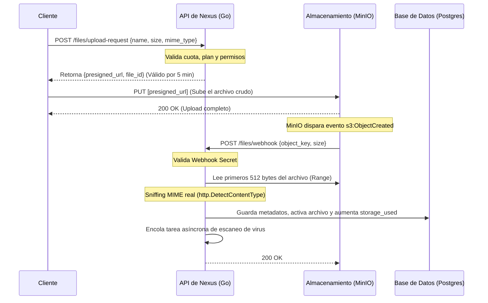

# Documentación de la API de Nexus Storage

Esta es la especificación técnica de la API REST de **Nexus Storage**, consumida tanto por los paneles oficiales (Cliente y Admin) como por integraciones externas de desarrolladores.

---

## 1. Autenticación

La API de Nexus Storage soporta dos métodos de autenticación:

### A. Autenticación JWT (Sesión del Navegador)
Utiliza la cabecera estándar `Authorization: Bearer <JWT_ACCESS_TOKEN>`.
Los tokens de acceso duran 15 minutos. Para prolongar la sesión, se realiza una rotación de tokens usando una cookie segura y `HttpOnly` (`refresh_token`).

### B. Claves de API (Integraciones Externas)
Los desarrolladores externos pueden autenticarse enviando su clave en la cabecera `X-API-Key` o `Authorization: Bearer <API_KEY>`. Las claves de API tienen límites de velocidad específicos (60 peticiones/minuto) y scopes detallados (`read`, `write`, `delete`, `admin`).

---

## 2. Flujo Obligatorio de Subida de Archivos

Para optimizar el rendimiento y evitar que la API actúe como un cuello de botella, **las subidas de archivos nunca pasan a través del backend de Go**. En su lugar, se realiza una subida directa de cliente a MinIO mediante URLs prefirmadas:



---

## 3. Endpoints del Sistema

### Rutas de Autenticación (`/api/v1/auth`)

#### `POST /auth/register`
Registra un nuevo usuario en la plataforma. Por defecto se le asigna el plan **Básico** (5GB).
- **Cuerpo:**
  ```json
  {
    "name": "Juan Pérez",
    "email": "juan@email.com",
    "password": "mi_password_seguro"
  }
  ```

#### `POST /auth/login`
Inicia sesión y retorna el token de acceso. Configura además la cookie de renovación.
- **Cuerpo:**
  ```json
  {
    "email": "juan@email.com",
    "password": "mi_password_seguro"
  }
  ```
- **Respuesta (200 OK):**
  ```json
  {
    "access_token": "eyJhbGciOi...",
    "user": {
      "id": "user-uuid",
      "name": "Juan Pérez",
      "email": "juan@email.com",
      "role": "client",
      "storage_used": 0
    }
  }
  ```

#### `POST /auth/refresh`
Intercambia la cookie `refresh_token` por un nuevo set de tokens (AccessToken + RefreshToken). Implementa rotación de tokens (el token de refresh antiguo queda invalidado).

#### `GET /auth/profile`
Retorna el perfil del usuario actual, el estado del plan contratado y métricas de almacenamiento reales.

---

### Rutas de Archivos (`/api/v1/files`)

#### `POST /files/upload-request`
Solicita una URL de MinIO prefirmada para subir un archivo.
- **Cabeceras:** `Authorization: Bearer <TOKEN>` o `X-API-Key: <KEY>`
- **Cuerpo:**
  ```json
  {
    "name": "foto.png",
    "size": 2048576,
    "mime_type": "image/png",
    "folder_id": "opcional-uuid-carpeta"
  }
  ```
- **Respuesta (200 OK):**
  ```json
  {
    "file_id": "file-uuid",
    "storage_key": "uploads/user-uuid/file-uuid/foto.png",
    "presigned_url": "http://localhost:9000/nexus-storage/uploads/..."
  }
  ```

#### `GET /files/list`
Lista las carpetas y archivos dentro del directorio especificado.
- **Parámetros de Consulta:** `folder_id` (vacío para directorio raíz).
- **Respuesta (200 OK):**
  ```json
  {
    "folders": [
      { "id": "uuid", "name": "Fotos", "path": "/Fotos" }
    ],
    "files": [
      { "id": "uuid", "name": "foto.png", "size_bytes": 2048576, "mime_type": "image/png", "scan_status": "clean" }
    ],
    "breadcrumbs": [
      { "id": "uuid", "name": "Fotos" }
    ]
  }
  ```

#### `GET /files/download/:id`
Genera una URL temporal prefirmada de MinIO con cabecera `attachment` para forzar la descarga del archivo.
- **Respuesta (200 OK):**
  ```json
  {
    "download_url": "http://localhost:9000/nexus-storage/..."
  }
  ```

#### `GET /files/preview/:id`
Genera una URL temporal prefirmada de MinIO con cabecera `inline` para previsualizar imágenes, PDFs o vídeos en el navegador.

#### `DELETE /files/:id`
Mueve el archivo seleccionado a la papelera (borrado lógico/soft-delete). En caso de borrado definitivo, se elimina del almacenamiento físico de MinIO y se actualiza la cuota de espacio.

---

### Rutas de Enlaces Compartidos (`/api/v1/shares`)

#### `POST /shares`
Crea un enlace público compartido para un archivo con protección de contraseña y expiración configurables.
- **Cuerpo:**
  ```json
  {
    "file_id": "file-uuid",
    "password": "clave_opcional",
    "expires_in_hours": 24
  }
  ```
- **Respuesta (201 Created):**
  ```json
  {
    "token": "share-token-hex-random",
    "expires_at": "2026-08-01T15:00:00Z",
    "has_pass": true
  }
  ```

#### `GET /shares/info/:token`
Retorna metadatos del archivo compartido (nombre, tamaño, tipo MIME y si requiere clave). **Ruta pública sin autenticar.**

#### `POST /shares/download/:token`
Retorna la URL de descarga del archivo compartido previa validación de la contraseña. **Ruta pública sin autenticar.**
- **Cuerpo:**
  ```json
  {
    "password": "clave_opcional"
  }
  ```

---

### Rutas Administrativas (`/api/v1/admin`)
*Todas estas rutas requieren rol de administrador.*

#### `GET /admin/stats`
Retorna métricas globales (usuarios activos, espacio consumido, total archivos) y salud en tiempo real de los nodos de MinIO.

#### `GET /admin/clients`
Lista de clientes, planes y espacios consumidos.

#### `PUT /admin/clients/:id/suspend`
Suspende o reactiva una cuenta de cliente. Si un cliente está suspendido, todas sus peticiones web y llamadas externas vía API Key retornarán inmediatamente `403 Forbidden`.

#### `PUT /admin/clients/:id/plan`
Modifica el plan de un cliente de forma inmediata sin afectar sus archivos existentes.
